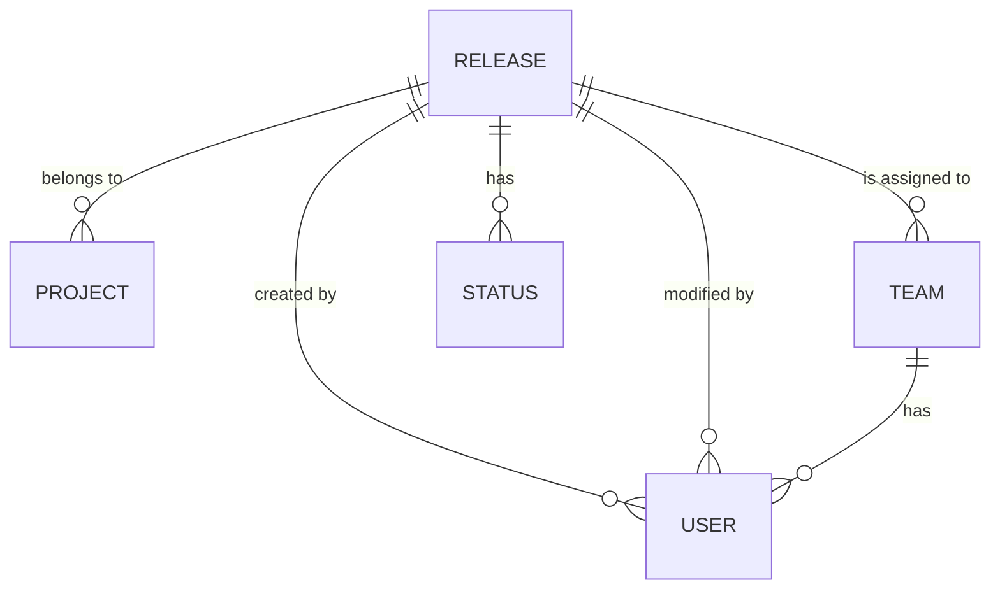

# Database Schema for Release Management System

This document outlines the database schema for the .NET Core 8 release management system. The schema is designed to support the registration, tracking, and management of software releases.

## Entities

The following entities will be created in the database:

- **Release**: Represents a software release.
- **Project**: Represents a project to which a release belongs.
- **Team**: Represents a team responsible for a release.
- **User**: Represents a user of the system.
- **Status**: Represents the status of a release.

## Entity Relationship Diagram

## Entity Definitions

### Release

| Column | Data Type | Constraints | Description |
|---|---|---|---|
| Id | int | Primary Key, Identity | Unique identifier for the release. |
| Name | nvarchar(255) | Not Null | The name of the release (e.g., "Q1 2025 Release"). |
| Description | nvarchar(max) | Null | A detailed description of the release. |
| ProjectId | int | Foreign Key (Project.Id) | The ID of the project to which the release belongs. |
| TeamId | int | Foreign Key (Team.Id) | The ID of the team responsible for the release. |
| StatusId | int | Foreign Key (Status.Id) | The ID of the current status of the release. |
| ReleaseDate | datetime | Not Null | The date of the release. |
| CreatedDate | datetime | Not Null | The date and time when the release was created. |
| ModifiedDate | datetime | Not Null | The date and time when the release was last modified. |
| CreatedBy | int | Foreign Key (User.Id) | The ID of the user who created the release. |
| ModifiedBy | int | Foreign Key (User.Id) | The ID of the user who last modified the release. |

### Project

| Column | Data Type | Constraints | Description |
|---|---|---|---|
| Id | int | Primary Key, Identity | Unique identifier for the project. |
| Name | nvarchar(255) | Not Null | The name of the project (e.g., "Project A"). |
| Description | nvarchar(max) | Null | A detailed description of the project. |

### Team

| Column | Data Type | Constraints | Description |
|---|---|---|---|
| Id | int | Primary Key, Identity | Unique identifier for the team. |
| Name | nvarchar(255) | Not Null | The name of the team (e.g., "Dev Team"). |
| Description | nvarchar(max) | Null | A detailed description of the team. |

### User

| Column | Data Type | Constraints | Description |
|---|---|---|---|
| Id | int | Primary Key, Identity | Unique identifier for the user. |
| Username | nvarchar(255) | Not Null, Unique | The username of the user. |
| Email | nvarchar(255) | Not Null, Unique | The email address of the user. |
| TeamId | int | Foreign Key (Team.Id) | The ID of the team to which the user belongs. |

### Status

| Column | Data Type | Constraints | Description |
|---|---|---|---|
| Id | int | Primary Key, Identity | Unique identifier for the status. |
| Name | nvarchar(255) | Not Null | The name of the status (e.g., "In Progress", "Completed", "Cancelled"). |
